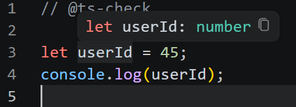

# Typescript

## What is Typescript

Typescript is a tooling as well as programming language.It is a Superset of javascript adding some features into it for maintainability,scalability,easy to understand and many more ...

## Some info about Vs code editor how it uses ts internally and other language services.

Vs code editor uses TS,HTML,CSS etc... language services internally which is preinstalled on it.If wanted a different language service then we install it to use those language service for c,c++,java,php etc...

When ever we hover or type the syntax then according to the service it starts the service for suggestion and brief info or docs links.

When ever new service started then a new process will started by the code editor .

## Use typescript features on js without ts compiler.

By using this comment we can use those features on js file on development
`//@ts-check`

## Running TS file in nodejs

We can run **typescript file** on nodejs interpreter on latest update of nodejs.

> Nodejs **strip** out the additional keywords which is present in JS.

## Adding types in TS

We can provide a specific types in the TS code to store only a specific value.

```ts
let userFullName: string = "Mohan Lal";
console.log(userFullName);
```

the string keyword used after colon of the variable name that we call **types** in TS.
The way where we adding types is know as **type annotation**.


the screenshot u where viewing that is know as **types infer** were TS automatically infer the type and set the type to that number or any thing according to the value datatype.
